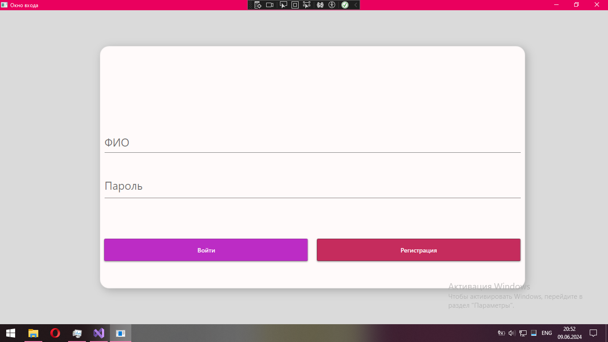

<h1 style="text-align:center;">OnlineStoreManagementSystem</h1>
<h2 style="text-align:center;">“Система управления интернет-магазином”</h2>

<h3>Описание:</h3>

Данный проект представляет из себя приложение на подобие интернет магазина в котором пользователи могут совершать покупки и отслеживать свои заказы.

В приложении присутствует четыре роли:

<ul>
  <li>Администратор</li>
  <li>Менеджер</li>
  <li>Оператор</li>
  <li>Клиент</li>
</ul>

В возможности адмистратора входят такие функции как:

<ul>
  <li>Редактировать пользователей и товары</li>
  <li>Просматривать отчёты</li>
</ul>

В возможности менеджера входят такие функции как:

<ul>
  <li>Просматривать информацию о клиентах, товарах и заказах</li>
  <li>Генерировать и просматривать отчёты</li>
</ul>

В возможности оператора входят такие функции как:

<ul>
  <li>Обрабатывать заказы</li>
  <li>Связоваться с клиентами</li>
</ul>

В возможности клиента входят такие функции как:

<ul>
  <li>Совершать покупки</li>
  <li>Отслеживать заказ</li>
</ul>

<h3>В ходе создания проекта применялись такие технологии как:</h3>
<ul>
  <li>Язык программирования C#</li>
  <li>Среда разработки Visual Studio</li>
  <li>СУБД SQL Server Management Studio (SSMS)</li>
  <li>Язык разметки XAML</li>
  <li>Библиотека Material Design</li>
</ul>

<h3>Скриншоты проекта:</h3>
<figure>
	
	
Рисунок 1 - окно входа

</figure>
<figure>
	
	
Рисунок 2 - окно регистрации

</figure>
<figure>
	
	
Рисунок 3 - окно магазина от лица клиента

</figure>
<figure>
	
	
Рисунок 4 - окно корзины

</figure>
<figure>
	
	
Рисунок 5 - окно выбора пункта выдачи

</figure>
<figure>
	
	
Рисунок 6 - окно отслеживания заказа

</figure>
<figure>
	
	
Рисунок 7 - окно магазина от лица администратора

</figure>
<figure>
	
	
Рисунок 8 - окно администратора

</figure>
<figure>
	
	
Рисунок 9 - окно просмотра отчётов

</figure>
<figure>
	
	
Рисунок 10 - окно редактирования пользователей

</figure>
<figure>
	
	
Рисунок 11 - окно редактирования продуктов

</figure>
<figure>
	
	
Рисунок 12 - окно магазина от лица менеджера

</figure>
<figure>
	
	
Рисунок 13 - окно менеджера

</figure>
<figure>
	
	
Рисунок 14 - окно отчётов

</figure>
<figure>
	
	
Рисунок 15 - окно просмотра информации о пользователях, товарах и заказах

</figure>
<figure>
	
	
Рисунок 16 - окно магазина от лица оператора

</figure>
<figure>
	
	
Рисунок 17 - окно оператора

</figure>

<h3>Видео демонстрация:</h3>
<h2>От лица администратора:</h2>

https://github.com/NecroDieMon/OnlineStoreManagementSystem/assets/116455805/871b41a3-2f1b-4785-a0b0-3966fe9aff6a

<h2>От лица менеджера:</h2>

https://github.com/NecroDieMon/OnlineStoreManagementSystem/assets/116455805/c6802400-636f-4c3c-9024-8ce9111f2c2f

<h2>От лица оператора:</h2>

https://github.com/NecroDieMon/OnlineStoreManagementSystem/assets/116455805/cda8ddeb-1e5e-411b-9ee8-b69523a24bc2

<h2>От лица клиента:</h2>

https://github.com/NecroDieMon/OnlineStoreManagementSystem/assets/116455805/7036ae60-fb99-419b-a40e-37075d84caf9

